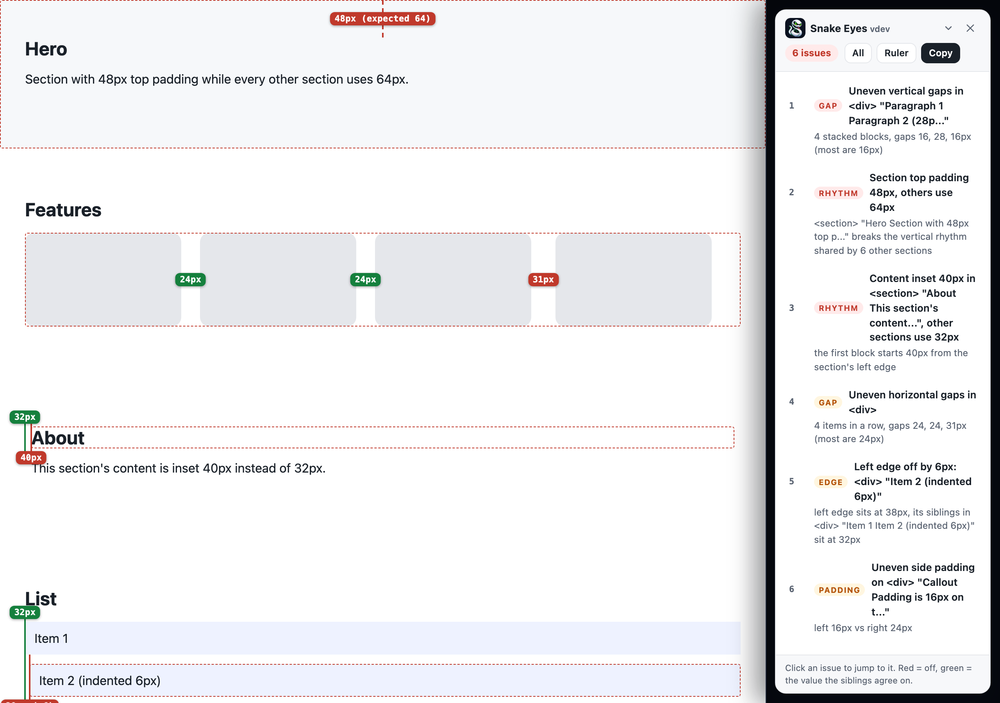
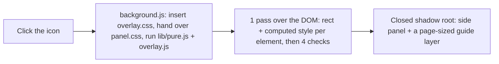

# Snake Eyes

[](https://github.com/bunlongheng/snake-eyes/actions/workflows/ci.yml)
[](manifest.json)
[](LICENSE)
[](package.json)

A Chrome extension that looks at the page you are on the way a picky designer does: uneven gaps between cards, a list item nudged 6px to the right, padding that is 16px on 1 side and 24px on the other, a section that breaks the vertical rhythm. Click the icon, it scans the page, draws red guides with the exact numbers, lists every issue in a side panel you can click through, and copies a report an AI agent can act on.



## Install

1. Clone or download this repo.
2. Open `chrome://extensions`, turn on **Developer mode**, click **Load unpacked**, pick the folder.
3. Pin the icon. Click it on any page to audit, click again to clear. Keyboard: `Alt+Shift+S` (change it at `chrome://extensions/shortcuts`).

Nothing runs until you click. The extension asks only for `activeTab` and `scripting`, so it can only touch the tab you clicked on, and only then. To audit a local `file://` page, enable **Allow access to file URLs** on the extension's details page.

## What it catches

| Check | What it compares | Guide it draws |
|-------|------------------|----------------|
| Gap | Gaps between 3 or more siblings in a row, or between stacked blocks | Dashed line across each gap with its px value, red when it differs from what the rest agree on |
| Edge | Left and right edges of stacked siblings | Solid green line at the shared edge, solid red line at the odd one, with the offset |
| Padding | Left vs right and top vs bottom padding on containers | Dashed spans inside the box with both numbers |
| Rhythm | Top and bottom padding across page sections, and the content inset in each section | Red span on the section that breaks the pattern, with the expected value |

Everything is measured from the rendered layout at the current viewport, tolerance 2px. Resize and the panel greys out, because every number on screen belongs to the old layout, and a Re-scan button appears to measure the new size.

### Measuring a state behind a click

The scan measures the page as it stands. Hand-tuned layout tends to drift in the states you have to
open: a modal, a menu, an expanded card. Open the state yourself, then press **Re-scan** in the
panel. It measures what is on screen now, including whatever the click just revealed.

### What it deliberately does not flag

A spacing auditor is only useful if you trust its silence, so these are skipped rather than guessed at:

- **Siblings that are not the same kind.** Comparing a heading against a card tells you nothing, so a row or stack is only measured when its children share a tag or a first class name.
- **Runs of text.** A paragraph with links in it has uneven gaps by nature. Inline children and mixed text nodes are left alone.
- **Centered groups.** Items centered on their parent are meant to have different edges.
- **Inline and inline-block elements.** A code chip inside a sentence starts wherever the words reach it. 3 chips on 3 lines look like a stack of siblings but were never meant to share an edge, so only block-level boxes are compared.
- **Anything inside a shadow root or an iframe.** The scan walks the main document only.
- **Sections that are not `<section>` elements.** The vertical rhythm check looks for real section tags, so a page built from divs gets the other 3 checks but not that one.

## The panel

On a window 1200px or wider the panel docks: the page narrows to about 80% and the panel takes the
strip beside it, so nothing is hidden behind it and the guides are never covered. The page gets its
width back when you close. Because the scan runs after the dock, the report quotes the width it
actually measured. Narrower windows keep a floating panel instead, since shrinking them would cross
a breakpoint and change the layout you were trying to audit.


- Issues sorted high to low. High is 8px or more off, medium 5 to 7, low 3 to 4. Anything inside the 2px tolerance is not reported at all. The list caps at 150, most severe first, and says so.
- Click an issue (or Tab to it and press Enter): the page scrolls to it, the element gets a red outline and its guides appear.
- **Show all** draws every guide at once. **Copy report** puts the markdown below on the clipboard. `Esc` closes and hands focus back where it was.
- On a phone-sized window the panel becomes a bottom sheet. It follows your light or dark theme.
- Resize the window and the guides clear, because they described the old layout. A **Re-scan** button takes their place.

## The report

```markdown
# Snake Eyes spacing report

- Page: https://example.dev/pricing
- Viewport: 1280x900
- Date: 2026-09-13
- Issues: 6 (3 high, 3 medium, 0 low)

Fix each item below in the source, then re-run Snake Eyes to confirm 0 issues. Selectors are relative to <body>.

## 1. Uneven vertical gaps in <div> "Paragraph 1 Paragraph 2 (28p..." (high)
- Selector: `section#stack > div > div.stack`
- Found: 4 stacked blocks, gaps 16, 28, 16px (most are 16px)
- Expected: 16px between every block

## 2. Section top padding 48px, others use 64px (high)
- Selector: `section#hero`
- Found: <section> "Hero Section with 48px top p..." breaks the vertical rhythm shared by 6 other sections
- Expected: padding-top: 64px
```

Paste it to your coding agent as is: every item has a selector, what was found, and what was expected. The report carries the page origin and path only, never the query string or fragment.

## How it works



| File | Role |
|------|------|
| `background.js` | The only thing that runs on install. Listens for the click, injects, and cleans up on toggle-off. |
| `lib/pure.js` | The math with no DOM: tolerance, severity bands, majority value, outliers, sibling kinds. Unit tested. |
| `overlay.js` | 4 named stages: `scanPage` reads the page once (capped at 8000 elements), `analyze` judges what it read, `buildReport` writes the markdown, `mount` draws the panel. Each runs on its own, and the tests drive them separately. |
| `panel.css` | The panel and guides, loaded into the shadow root as a constructed stylesheet. |
| `overlay.css` | 1 rule for the host element so page CSS cannot hide or re-stack it. |

The overlay adds 1 element to the page, `#snake-eyes-root`, with a closed shadow root inside. Page CSS cannot restyle it, page script cannot reach into it, and it never edits your DOM. Clicking again removes it and the 1 injected rule.

## Privacy

- Nothing runs until you click. There is no background scanning, no content script on page load.
- Nothing leaves the browser. No network requests, no storage, no analytics.
- The report you copy contains the page's origin and path, your viewport size, element selectors and short text labels. That is all.

## Tests

```bash
npm install
npx playwright install chromium   # once
npm test            # unit tests, the overlay against 3 pages, then the real extension loaded in Chromium
npm run lint        # eslint, zero warnings
npm run check:version   # manifest.json and package.json must agree
npm run pack        # zip just the files Chrome needs, for a release or a store upload
npm run icons       # regenerate the icon PNGs
npm run hero        # refresh docs/hero.png from the fixture
```

`tests/fixture.html` plants exactly 1 mistake per check (6 in all) next to prose with inline links and deep nesting that must not be flagged. `tests/fixture2.html` covers the branches the first one cannot reach: a right edge, top against bottom padding, and a section that ends early. `tests/clean.html` is the control, including centered flex groups that must stay silent. The browser test asserts exactly those 6 come back, that every selector resolves to its element, that the panel works by mouse and keyboard, that every header control stays inside the panel and clickable at 3 widths and in dark mode, that a resize greys the panel out, that `tests/clean.html` yields 0 issues, and that a 200-issue page is capped at 150 most severe first. The fixture also runs at 390px and 768px. A third suite loads the unpacked extension in Chromium and drives the service worker itself, so the manifest, the CSS hand-off, the toggle and the Escape cleanup are covered by something other than a hand-rolled injection. CI runs all of it on every push to main and every pull request, on Node 22 with SHA-pinned actions. A `v*` tag runs the suite again and attaches a zip of the extension to the GitHub release.

## Decisions

| Decision | Why |
|----------|-----|
| Measure the rendered layout, not the CSS | What the eye sees is the bounding box. A 24px gap made of margin plus padding is still a 24px gap. |
| A real majority, or silence | The expected value has to be one most siblings actually share. 3 buttons at their natural widths agree on nothing, so nothing is reported. Guessing a middle value there would invent a rule the designer never wrote. |
| 2px tolerance | Subpixel rounding and borders create 1px noise. 3px is where a human starts to notice. |
| Report first, pictures second | The clipboard report is the product. Guides exist so you can trust the report before pasting it. |
| No background scanning | It only runs when clicked. A spacing audit on every page load would be noise and a privacy problem. |
| Prose is not a layout | A paragraph with links has uneven "gaps" by nature. Text runs and centered stacks are skipped, not reported. |
| Cap after sort | When a page has more than 150 issues, the 150 kept are the worst ones, and the report says how many were left. |

## Author

Bunlong Heng, Senior Full-Stack Developer & Architect. [bunlongheng.com](https://bunlongheng.com) | [GitHub](https://github.com/bunlongheng) | [LinkedIn](https://www.linkedin.com/in/bunlongheng)

## License

MIT. See [LICENSE](LICENSE).
