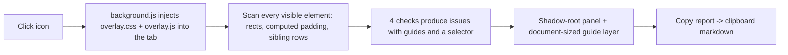

# Snake Eyes

[](https://github.com/bunlongheng/snake-eyes/actions/workflows/ci.yml)
[](manifest.json)
[](LICENSE)
[](package.json)

A Chrome extension that looks at the page you are on the way a picky designer does: uneven gaps between cards, a list item nudged 6px to the right, padding that is 16px on 1 side and 24px on the other, a section that breaks the vertical rhythm. Click the icon, it scans the page, draws red guides with the exact numbers, lists every issue in a side panel you can click through, and copies a report an AI agent can act on.


## Install

1. Clone or download this repo.
2. Open `chrome://extensions`, turn on **Developer mode**, click **Load unpacked**, pick the folder.
3. Pin the icon. Click it on any page to audit, click again to clear.

Nothing runs until you click. The extension asks only for `activeTab`, `scripting` and `clipboardWrite`.

## What it catches

| Check | What it compares | Guide it draws |
|-------|------------------|----------------|
| Gap | Gaps between 3 or more siblings in a row, or between stacked blocks | Dashed line across each gap with its px value, red when it differs from what the rest agree on |
| Edge | Left and right edges of stacked siblings | Solid green line at the shared edge, solid red line at the odd one, with the offset |
| Padding | Left vs right and top vs bottom padding on containers | Dashed spans inside the box with both numbers |
| Rhythm | Top and bottom padding across page sections, and the content inset in each section | Red span on the section that breaks the pattern, with the expected value |

Everything is measured from the rendered layout at the current viewport, tolerance 2px. Resize and click again to audit another width.

## The panel

- Issues sorted high to low. High is 8px or more off, medium 3 to 7, low under 3.
- Click an issue: the page scrolls to it, the element gets a red outline and its guides appear.
- **Show all** draws every guide at once. **Copy report** puts the markdown below on the clipboard.

## The report

```markdown
# Snake Eyes spacing report

- Page: https://example.dev/
- Viewport: 1440x900
- Issues: 7 (2 high, 3 medium, 2 low)

## 1. Uneven horizontal gaps in <div> (high)
- Selector: `section#features > div.wrap > div.cards`
- Found: 4 items in a row, gaps 24, 24, 31px (most are 24px)
- Expected: 24px between every item
```

Paste it to your coding agent as is: every item has a selector, what was found, and what was expected.

## How it works



The overlay lives in a shadow root under `#snake-eyes-root`, so page CSS cannot restyle it and it cannot restyle the page. The page DOM is never modified.

## Tests

```bash
npm install
npm test     # headless Chromium: injects the overlay into tests/fixture.html, checks all 6 planted mistakes are found, the panel works, the report copies
npm run lint
```

`tests/fixture.html` plants 1 mistake per check. CI runs the same on every push.

## Decisions

| Decision | Why |
|----------|-----|
| Measure the rendered layout, not the CSS | What the eye sees is the bounding box. A 24px gap made of margin plus padding is still a 24px gap. |
| The majority wins | The expected value is what most siblings agree on. The odd one out is the bug, not the design. |
| 2px tolerance | Subpixel rounding and borders create 1px noise. 3px is where a human starts to notice. |
| Report first, pictures second | The clipboard report is the product. Guides exist so you can trust the report before pasting it. |
| No background scanning | It only runs when clicked. A spacing audit on every page load would be noise and a privacy problem. |

## Author

Bunlong Heng, Senior Full-Stack Developer & Architect. [bunlongheng.com](https://bunlongheng.com) | [GitHub](https://github.com/bunlongheng) | [LinkedIn](https://www.linkedin.com/in/bunlongheng)

## License

MIT. See [LICENSE](LICENSE).
